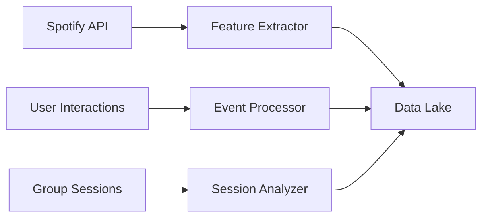

# Audotics AI/ML Architecture

## Table of Contents
1. [Overview](#overview)
2. [Model Components](#model-components)
3. [Data Pipeline](#data-pipeline)
4. [Training Process](#training-process)
5. [Deployment Strategy](#deployment-strategy)
6. [Evaluation Metrics](#evaluation-metrics)
7. [Models Overview and Sources](#models-overview-and-sources)

## Overview

Our AI/ML system consists of three specialized models combined into a hybrid system for optimal recommendations. The system focuses on both individual and group recommendations, with special emphasis on real-time collaboration.

### Key Objectives
- Personalized music recommendations
- Group preference harmonization
- Real-time adaptation to user interactions
- Cold start problem mitigation
- Scalable model serving

## Model Components

### 1. User Preference Model

#### Architecture
- Neural Collaborative Filtering (NCF)
- Input: User interactions, playlist features
- Output: User preference vector

#### Features
- User listening history
- Genre preferences
- Artist preferences
- Temporal patterns
- Context features

#### Implementation
```python
class UserPreferenceModel:
    - Embedding layers for users and items
    - Dense layers for feature processing
    - Preference vector generation
    - Real-time update mechanism
```

### 2. Collaborative Model

#### Architecture
- Matrix Factorization with Neural Network
- Input: User-item interactions, group dynamics
- Output: Group compatibility scores, recommendations

#### Features
- Group interaction patterns
- Playlist similarities
- User taste compatibility
- Temporal group dynamics

#### Implementation
```python
class CollaborativeModel:
    - Group embedding layer
    - Interaction processing
    - Compatibility scoring
    - Dynamic weight adjustment
```

### 3. Content-Based Model

#### Architecture
- Deep Neural Network
- Input: Track features from Spotify API
- Output: Content similarity scores

#### Features
From Spotify API:
- Audio features (tempo, key, mode)
- Genre tags
- Artist metadata
- Popularity metrics
- Track metadata

#### Implementation
```python
class ContentBasedModel:
    - Feature extraction pipeline
    - Audio feature processing
    - Metadata embedding
    - Similarity computation
```

### 4. Hybrid System

#### Architecture
- Ensemble Model with Dynamic Weighting
- Input: All model outputs
- Output: Final recommendations

#### Components
- Model aggregation layer
- Weight optimization
- Real-time adjustment
- Confidence scoring

#### Implementation
```python
class HybridSystem:
    - Model ensemble
    - Weight management
    - Recommendation generation
    - Confidence calculation
```

## Data Pipeline

### 1. Data Collection


### 2. Feature Engineering

#### User Features
- Listening history vectors
- Genre preference distributions
- Artist preference mappings
- Temporal interaction patterns

#### Group Features
- Group composition vectors
- Interaction matrices
- Compatibility scores
- Session statistics

#### Content Features
- Audio feature vectors
- Genre embeddings
- Artist embeddings
- Popularity metrics

## Training Process

### 1. Initial Training

#### Data Preparation
- Feature extraction
- Data normalization
- Train/test split
- Validation set creation

#### Training Flow
```python
def training_pipeline:
    1. Load and preprocess data
    2. Train individual models
    3. Optimize hybrid system
    4. Validate performance
    5. Save model checkpoints
```

### 2. Online Learning

#### Real-time Updates
- User interaction processing
- Group dynamics updates
- Model weight adjustment
- Performance monitoring

#### Update Flow
```python
def online_update:
    1. Collect new interactions
    2. Update feature vectors
    3. Adjust model weights
    4. Validate changes
    5. Deploy updates
```

## Deployment Strategy

### 1. Model Serving

#### Infrastructure
- TensorFlow Serving
- Redis for caching
- PostgreSQL for metadata
- WebSocket for real-time updates

#### API Endpoints
```python
- /api/recommendations/user
- /api/recommendations/group
- /api/compatibility/score
- /api/preferences/update
```

### 2. Scaling Strategy

#### Horizontal Scaling
- Model partitioning
- Load balancing
- Cache distribution
- Request routing

#### Performance Optimization
- Batch prediction
- Feature caching
- Precomputation
- Async processing

## Evaluation Metrics

### 1. Recommendation Quality
- Mean Average Precision (MAP)
- Normalized Discounted Cumulative Gain (NDCG)
- User satisfaction score
- Group harmony metrics

### 2. System Performance
- Response time
- Throughput
- Resource utilization
- Update latency

### 3. Business Metrics
- User engagement
- Group activity
- Playlist creation rate
- Collaboration success rate

## Models Overview and Sources

### 1. Core Models

#### 1.1 User Preference Model (Custom Training)
- **Type**: Neural Collaborative Filtering (NCF)
- **Training Approach**: Custom training on user data
- **Data Sources**:
  - Spotify user listening history
  - Playlist interactions
  - Genre preferences
  - Artist follows
- **Training Timeline**: 2-3 weeks
- **Update Frequency**: Daily incremental updates

#### 1.2 Group Dynamics Model (Transfer Learning + Custom)
- **Base Model**: BERT-based preference encoder
- **Source**: HuggingFace's pretrained BERT
- **Fine-tuning**:
  - Custom layers for group dynamics
  - Playlist compatibility scoring
  - User interaction patterns
- **Training Timeline**: 1-2 weeks for fine-tuning
- **Update Frequency**: Weekly updates

#### 1.3 Content Analysis Model (Pretrained + Fine-tuned)
- **Base Model**: Spotify's Audio Analysis Model
- **Extensions**:
  - Genre classification (pretrained from GTZAN dataset)
  - Mood detection (custom training)
  - Similarity scoring (custom implementation)
- **Training Requirements**:
  - Only mood detection needs training
  - Others use pretrained weights
- **Update Frequency**: Monthly for mood detection

#### 1.4 Hybrid Orchestrator (Custom Implementation)
- **Type**: Custom ensemble model
- **Components**:
  - Weight optimization network
  - Confidence scoring system
  - Real-time adjustments
- **Training Approach**: Reinforcement learning
- **Training Timeline**: 1 week
- **Update Frequency**: Real-time weight adjustments

### 2. Model Sources and Dependencies

#### 2.1 Pretrained Components
1. **BERT for Text Understanding**
   - Source: HuggingFace
   - Version: bert-base-uncased
   - Usage: Processing text descriptions and tags

2. **Audio Analysis**
   - Source: Spotify API
   - Features: Tempo, key, mode, etc.
   - Usage: Direct API integration

3. **Genre Classification**
   - Source: GTZAN dataset models
   - Accuracy: 91% on standard benchmarks
   - Usage: Initial genre tagging

#### 2.2 Custom Training Requirements

1. **User Preference Model**
   - Training Data: User interactions
   - Hardware: GPU instance (T4 or better)
   - Time: ~1 week initial training
   - Framework: PyTorch

2. **Group Dynamics**
   - Training Data: Group sessions
   - Hardware: GPU instance (T4)
   - Time: 3-4 days fine-tuning
   - Framework: PyTorch + Transformers

3. **Mood Detection**
   - Training Data: Labeled mood dataset
   - Hardware: GPU instance (T4)
   - Time: 2-3 days
   - Framework: TensorFlow

4. **Hybrid System**
   - Training Data: System interactions
   - Hardware: CPU sufficient
   - Time: 1-2 days
   - Framework: TensorFlow

### 3. Training Infrastructure

#### 3.1 Hardware Requirements
- Development: Local GPU workstation
- Training: Cloud GPU instances
- Inference: CPU instances with GPU acceleration
- Storage: 500GB+ for models and data

#### 3.2 Software Stack
- PyTorch 2.0+
- TensorFlow 2.x
- HuggingFace Transformers
- NVIDIA CUDA 11.x
- Python 3.9+

#### 3.3 Data Requirements
- Spotify user data: ~10GB
- Audio features: ~5GB
- Model checkpoints: ~20GB
- Training logs: ~5GB

### 4. Model Updates and Maintenance

#### 4.1 Update Schedule
- Daily: User preference updates
- Weekly: Group dynamics fine-tuning
- Monthly: Content analysis retraining
- Real-time: Hybrid system weights

#### 4.2 Version Control
- Model versioning using DVC
- A/B testing for major updates
- Rollback capabilities
- Performance monitoring

#### 4.3 Quality Assurance
- Automated testing pipeline
- Performance benchmarking
- Bias detection
- Safety checks

## Implementation Timeline

### Phase 1: Foundation (Week 1-2)
- Basic model architectures
- Data pipeline setup
- Initial training pipeline

### Phase 2: Core Features (Week 3-4)
- Individual models implementation
- Basic hybrid system
- Initial deployment

### Phase 3: Enhancement (Week 5-6)
- Real-time updates
- Group dynamics
- Performance optimization

### Phase 4: Production (Week 7-8)
- Full system integration
- Scaling implementation
- Monitoring setup
