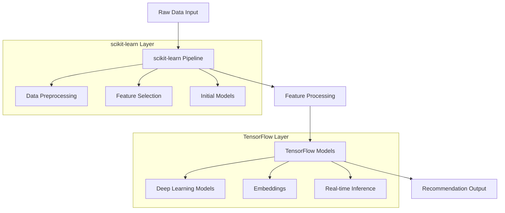

# Audotics ML Architecture

## Overview

Audotics implements a hybrid machine learning architecture leveraging both scikit-learn and TensorFlow to create a robust, scalable recommendation system.

## Architecture Design



## Component Breakdown

### 1. Data Processing Layer (scikit-learn)
```python
class DataProcessor:
    def __init__(self):
        self.pipeline = Pipeline([
            ('scaler', StandardScaler()),
            ('feature_selector', SelectKBest(k=100)),
            ('dim_reducer', PCA(n_components=50))
        ])
        
    def process_features(self, raw_data):
        return self.pipeline.fit_transform(raw_data)
```

Key Components:
- Data normalization
- Feature selection
- Dimensionality reduction
- Quick experimentation
- A/B testing

### 2. Deep Learning Layer (TensorFlow)
```python
class DeepRecommender(tf.keras.Model):
    def __init__(self, config):
        super().__init__()
        self.user_embedding = tf.keras.layers.Embedding(
            config.num_users, 
            config.embedding_dim
        )
        self.track_embedding = tf.keras.layers.Embedding(
            config.num_tracks, 
            config.embedding_dim
        )
        self.prediction_layers = tf.keras.Sequential([
            tf.keras.layers.Dense(128, activation='relu'),
            tf.keras.layers.Dense(64, activation='relu'),
            tf.keras.layers.Dense(32, activation='relu'),
            tf.keras.layers.Dense(1, activation='sigmoid')
        ])
```

Key Components:
- User embeddings
- Track embeddings
- Deep neural networks
- Real-time predictions

## Integration Points

### 1. Feature Pipeline
```python
class FeaturePipeline:
    def __init__(self):
        # scikit-learn preprocessing
        self.preprocessor = DataProcessor()
        
        # TensorFlow model
        self.deep_model = DeepRecommender(ModelConfig())
        
    def process_and_predict(self, user_data, track_data):
        # Preprocess with scikit-learn
        processed_user = self.preprocessor.process_features(user_data)
        processed_track = self.preprocessor.process_features(track_data)
        
        # Generate predictions with TensorFlow
        return self.deep_model.predict([processed_user, processed_track])
```

### 2. Training Pipeline
```python
class TrainingPipeline:
    def __init__(self):
        self.feature_pipeline = FeaturePipeline()
        self.model_evaluator = ModelEvaluator()
        
    def train(self, training_data):
        # Preprocess data
        processed_data = self.feature_pipeline.preprocessor.process_features(
            training_data
        )
        
        # Train model
        self.feature_pipeline.deep_model.fit(
            processed_data,
            epochs=100,
            validation_split=0.2
        )
        
        # Evaluate performance
        metrics = self.model_evaluator.evaluate(
            self.feature_pipeline.deep_model,
            processed_data
        )
        return metrics
```

## Performance Optimization

### 1. Caching Strategy
```python
class CacheManager:
    def __init__(self):
        self.redis_client = Redis()
        
    def cache_predictions(self, user_id, predictions):
        self.redis_client.setex(
            f"user:{user_id}:predictions",
            timedelta(hours=24),
            json.dumps(predictions)
        )
```

### 2. Batch Processing
```python
class BatchProcessor:
    def process_batch(self, batch_data):
        with tf.device('/GPU:0'):
            return self.model.predict(batch_data)
```

## Monitoring & Evaluation

### 1. Metrics Collection
```python
class MetricsCollector:
    def collect_metrics(self, predictions, actual):
        return {
            'accuracy': accuracy_score(actual, predictions),
            'precision': precision_score(actual, predictions),
            'recall': recall_score(actual, predictions),
            'f1': f1_score(actual, predictions)
        }
```

### 2. Performance Monitoring
```python
class PerformanceMonitor:
    def monitor_inference_time(self, func):
        @wraps(func)
        def wrapper(*args, **kwargs):
            start_time = time.time()
            result = func(*args, **kwargs)
            duration = time.time() - start_time
            log_metric('inference_time', duration)
            return result
        return wrapper
```

## Deployment Strategy

### 1. Model Serving
- TensorFlow Serving for production models
- scikit-learn pipelines as preprocessing services
- GPU acceleration for inference
- Load balancing across multiple instances

### 2. Scaling Considerations
- Horizontal scaling for preprocessing
- Vertical scaling for deep learning
- Caching frequently accessed predictions
- Batch processing for efficiency

## Best Practices

1. Data Processing:
   - Use scikit-learn for initial data exploration
   - Implement robust preprocessing pipelines
   - Validate data quality before deep learning

2. Model Development:
   - Prototype with scikit-learn
   - Scale with TensorFlow
   - Maintain clear separation of concerns

3. Production Deployment:
   - Monitor model performance
   - Implement fallback mechanisms
   - Regular model retraining
   - Cache frequent predictions

4. Testing & Validation:
   - Unit tests for each component
   - Integration tests for pipelines
   - A/B testing for model changes
   - Performance benchmarking

## Future Improvements

1. Model Enhancements:
   - Advanced embedding techniques
   - Attention mechanisms
   - Multi-task learning

2. Infrastructure:
   - Distributed training
   - Model versioning
   - Automated retraining
   - A/B testing framework

3. Features:
   - Real-time personalization
   - Context-aware recommendations
   - Collaborative filtering
   - Content-based filtering
