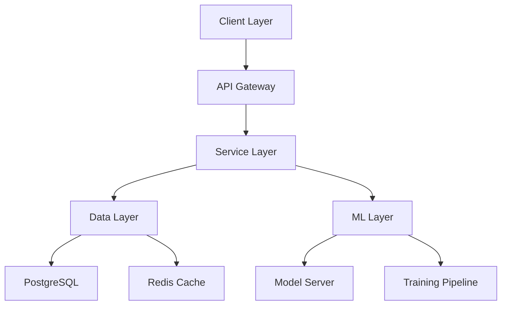

# Audotics Technical Specifications

## System Architecture

### Infrastructure Overview


### Component Specifications

#### 1. Frontend Application
- **Technology Stack**:
  - Framework: React 18.x
  - State Management: Redux Toolkit
  - UI Library: Material-UI v5
  - Build Tool: Vite
  - Testing: Jest + React Testing Library

- **Key Components**:
  ```typescript
  // Core interfaces
  interface User {
    id: string;
    username: string;
    preferences: UserPreferences;
    playlists: Playlist[];
  }

  interface Playlist {
    id: string;
    name: string;
    tracks: Track[];
    collaborative: boolean;
    context?: PlaylistContext;
  }

  interface Track {
    id: string;
    title: string;
    artist: string;
    features: AudioFeatures;
    metadata: TrackMetadata;
  }
  ```

#### 2. Backend Services

##### API Gateway
- **Technology**: Node.js with Express
- **Features**:
  - Rate Limiting
  - Authentication
  - Request Validation
  - Response Caching
  - Error Handling

##### Microservices
1. **User Service**
   ```typescript
   @Service()
   class UserService {
     async createUser(userData: UserDTO): Promise<User>;
     async updatePreferences(userId: string, prefs: UserPreferences): Promise<void>;
     async getUserRecommendations(userId: string): Promise<Track[]>;
   }
   ```

2. **Playlist Service**
   ```typescript
   @Service()
   class PlaylistService {
     async createPlaylist(playlistData: PlaylistDTO): Promise<Playlist>;
     async addTrack(playlistId: string, trackId: string): Promise<void>;
     async generatePlaylist(context: PlaylistContext): Promise<Track[]>;
   }
   ```

3. **Recommendation Service**
   ```typescript
   @Service()
   class RecommendationService {
     async getRecommendations(params: RecommendationParams): Promise<Track[]>;
     async updateUserModel(userId: string, interactions: UserInteraction[]): Promise<void>;
     async batchTrainModel(): Promise<void>;
   }
   ```

#### 3. Database Schema

##### Users Table
```sql
CREATE TABLE users (
    user_id UUID PRIMARY KEY DEFAULT uuid_generate_v4(),
    username VARCHAR(50) UNIQUE NOT NULL,
    email VARCHAR(255) UNIQUE NOT NULL,
    password_hash VARCHAR(255) NOT NULL,
    preferences JSONB DEFAULT '{}',
    created_at TIMESTAMP WITH TIME ZONE DEFAULT CURRENT_TIMESTAMP,
    updated_at TIMESTAMP WITH TIME ZONE DEFAULT CURRENT_TIMESTAMP
);

CREATE INDEX idx_users_username ON users(username);
CREATE INDEX idx_users_email ON users(email);
```

##### Playlists Table
```sql
CREATE TABLE playlists (
    playlist_id UUID PRIMARY KEY DEFAULT uuid_generate_v4(),
    name VARCHAR(100) NOT NULL,
    user_id UUID REFERENCES users(user_id),
    is_collaborative BOOLEAN DEFAULT false,
    context JSONB DEFAULT '{}',
    created_at TIMESTAMP WITH TIME ZONE DEFAULT CURRENT_TIMESTAMP,
    updated_at TIMESTAMP WITH TIME ZONE DEFAULT CURRENT_TIMESTAMP
);

CREATE INDEX idx_playlists_user_id ON playlists(user_id);
```

##### Tracks Table
```sql
CREATE TABLE tracks (
    track_id UUID PRIMARY KEY DEFAULT uuid_generate_v4(),
    title VARCHAR(255) NOT NULL,
    artist VARCHAR(255) NOT NULL,
    album VARCHAR(255),
    duration_ms INTEGER NOT NULL,
    features JSONB DEFAULT '{}',
    metadata JSONB DEFAULT '{}',
    created_at TIMESTAMP WITH TIME ZONE DEFAULT CURRENT_TIMESTAMP
);

CREATE INDEX idx_tracks_title_artist ON tracks(title, artist);
```

#### 4. ML Model Architecture

##### Hybrid Recommendation System
```python
class HybridRecommender:
    def __init__(self, config: ModelConfig):
        # scikit-learn preprocessing
        self.preprocessor = Pipeline([
            ('scaler', StandardScaler()),
            ('feature_selector', SelectKBest()),
            ('dim_reducer', PCA(n_components=50))
        ])
        
        # TensorFlow deep learning
        self.user_embedding = tf.keras.layers.Embedding(
            config.num_users, 
            config.embedding_dim
        )
        self.track_embedding = tf.keras.layers.Embedding(
            config.num_tracks, 
            config.embedding_dim
        )
        self.prediction_head = tf.keras.Sequential([
            tf.keras.layers.Dense(128, activation='relu'),
            tf.keras.layers.Dense(64, activation='relu'),
            tf.keras.layers.Dense(1, activation='sigmoid')
        ])

    def preprocess(self, data):
        return self.preprocessor.fit_transform(data)
        
    def forward(self, 
                user_ids: tf.Tensor,
                track_ids: tf.Tensor,
                context: Optional[tf.Tensor] = None) -> tf.Tensor:
        # Preprocess inputs
        processed_user = self.preprocess(user_ids)
        processed_track = self.preprocess(track_ids)
        
        # Generate embeddings
        user_emb = self.user_embedding(processed_user)
        track_emb = self.track_embedding(processed_track)
        
        if context is not None:
            processed_context = self.preprocess(context)
            combined = tf.concat([user_emb, track_emb, processed_context], axis=-1)
        else:
            combined = tf.concat([user_emb, track_emb], axis=-1)
        
        return self.prediction_head(combined)
```

### API Specifications

#### 1. REST API Endpoints

##### User Management
```typescript
/**
 * @route POST /api/users
 * @desc Create a new user
 */
interface CreateUserRequest {
    username: string;
    email: string;
    password: string;
}

/**
 * @route GET /api/users/{userId}/recommendations
 * @desc Get personalized recommendations
 */
interface GetRecommendationsResponse {
    tracks: Track[];
    context?: RecommendationContext;
}
```

##### Playlist Management
```typescript
/**
 * @route POST /api/playlists
 * @desc Create a new playlist
 */
interface CreatePlaylistRequest {
    name: string;
    isCollaborative?: boolean;
    context?: PlaylistContext;
}

/**
 * @route PUT /api/playlists/{playlistId}/tracks
 * @desc Add tracks to playlist
 */
interface AddTracksRequest {
    trackIds: string[];
    position?: number;
}
```

#### 2. WebSocket Events

##### Real-time Collaboration
```typescript
interface CollaborationEvent {
    type: 'TRACK_ADDED' | 'TRACK_REMOVED' | 'PLAYLIST_UPDATED';
    playlistId: string;
    userId: string;
    timestamp: number;
    data: any;
}
```

### Security Specifications

#### 1. Authentication
- OAuth 2.0 with JWT
- Refresh token rotation
- Rate limiting per user/IP
- 2FA support

#### 2. Data Protection
```typescript
interface SecurityConfig {
    encryption: {
        algorithm: 'AES-256-GCM';
        keyRotationPeriod: 30; // days
    };
    authentication: {
        jwtExpiry: '1h';
        refreshTokenExpiry: '7d';
        rateLimits: {
            api: 1000; // requests per hour
            login: 5; // attempts per minute
        };
    };
}
```

### Performance Requirements

#### 1. Response Times
- API Response: < 200ms (95th percentile)
- Recommendation Generation: < 500ms
- Real-time Updates: < 100ms

#### 2. Scalability
- Support for 100K+ concurrent users
- Handle 1M+ tracks
- Process 10K+ recommendations/second

#### 3. Availability
- System Uptime: 99.9%
- Data Durability: 99.999%
- Backup Frequency: Every 6 hours
